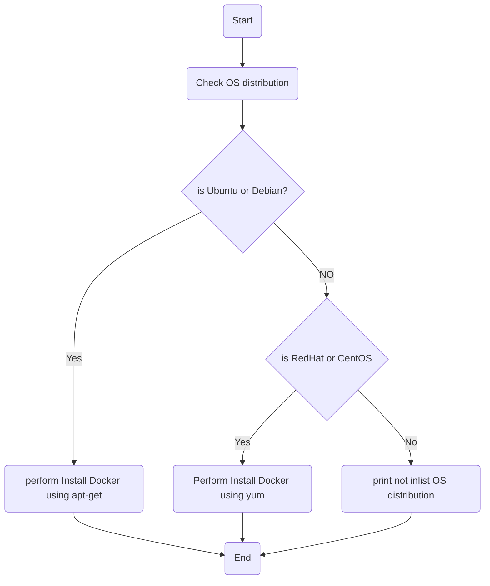

# Task1:
write a bash script do this:\
    1- Detect OS distribution.\
    2- Based on OS distribution decide to use apt-get or yum to install docker.
## Flowchart:

```mermaid
flowchart TD
    start(Start) --> check_OS_distrib(Check OS distribution);
    check_OS_distrib --> 
    is_ubuntu{is Ubuntu or Debian?};
    is_ubuntu --> |Yes|Ubuntu_Debian_install(perform Install Docker using apt-get);
    is_ubuntu-->|NO|is_RH{is RedHat or CentOS};
    is_RH-->|Yes|RedHat_CentOS_install(Perform Install Docker using yum);
    RedHat_CentOS_install--> End(End);
    Ubuntu_Debian_install -->End;
    is_RH-->|No|not_available(print not inlist OS distribution);
    not_available-->End
```
