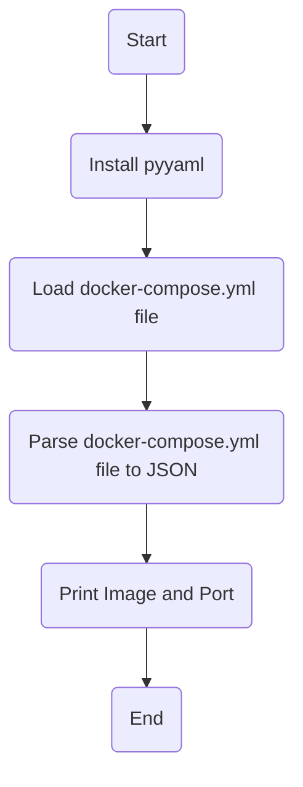

# Task2: 
write a script that do this:\
    1- read .yaml file ( ex:" docker-compose.yaml").\
    2-parse it into json format and edit image value.\
    3- then parse it back into .yaml format.

## Flowchart:

## How to run the script:
there is two approchs to do that:\
    1- Use pyyaml python lib.\
    2- Use jq and yq python libs.
